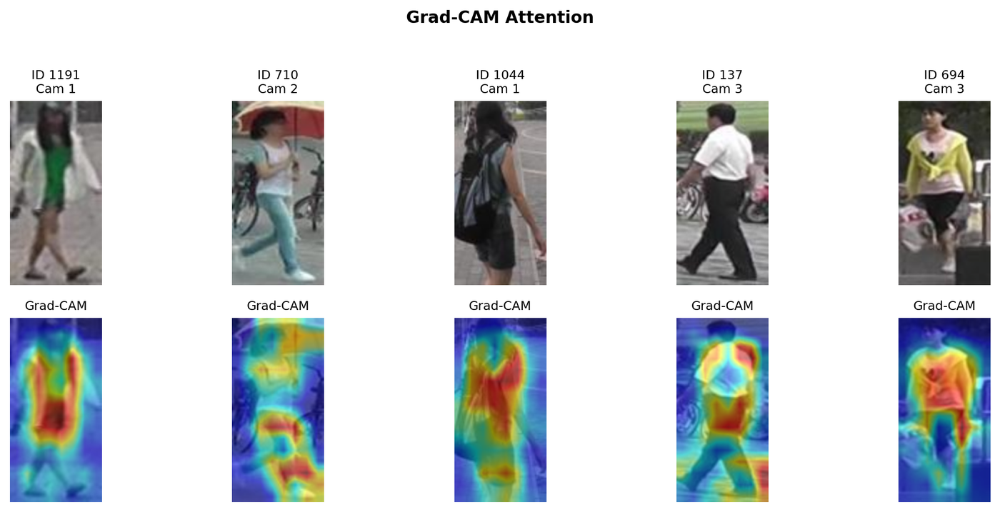
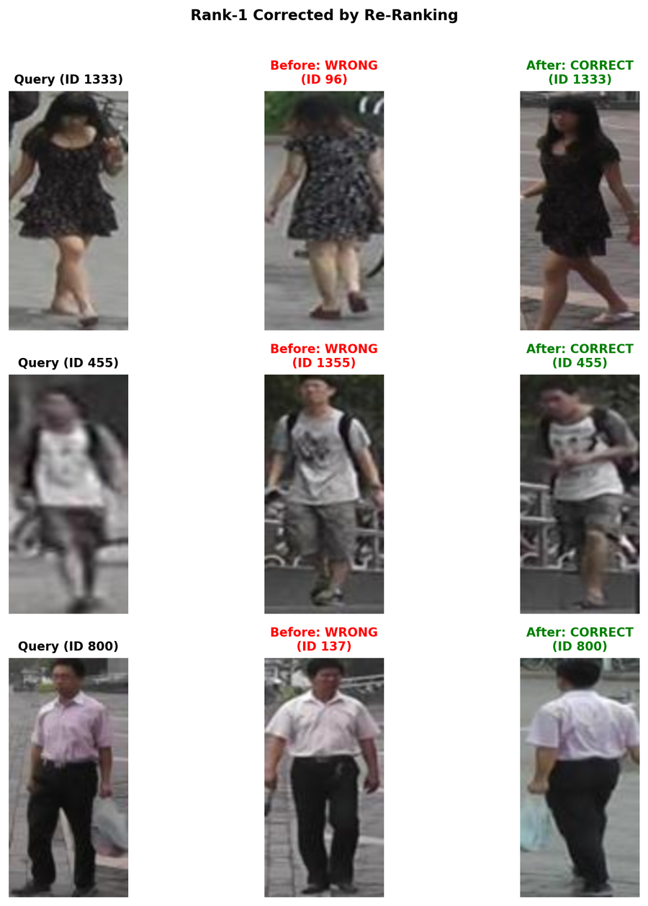
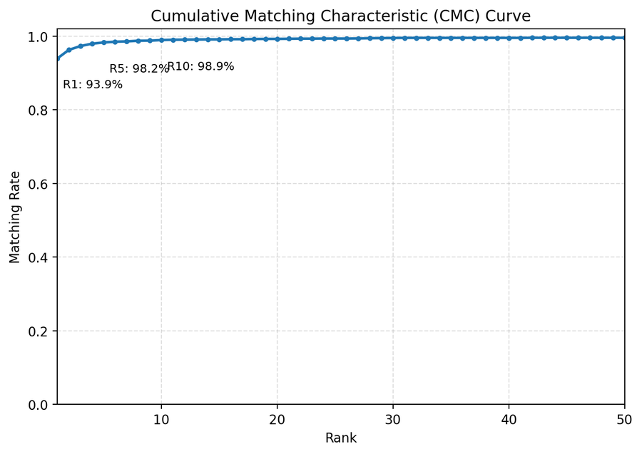

<div align="center">

# 🔍 Secondsight

### Find the same person again on a different camera

Secondsight is a person re-identification system. You give it one cropped photo of a person, and it
searches a large collection of other photos and ranks them by how likely each one shows that same
person, seen later by a different camera. On the standard Market-1501 benchmark the right person is
the very first result **93.9% of the time**, and **95.0%** with an extra re-ranking step.

**[▶ Train it in Colab](https://colab.research.google.com/github/vardhjain/Secondsight/blob/main/notebooks/train_colab.ipynb)** &nbsp;·&nbsp; **[📊 Results](#results)** &nbsp;·&nbsp; **[⚙️ How it works](#how-it-works)** &nbsp;·&nbsp; **[🧠 Model card](docs/MODEL_CARD.md)**

[](https://github.com/vardhjain/Secondsight/actions/workflows/ci.yml)
[](https://www.python.org/downloads/)
[](LICENSE)
[](https://pytorch.org/)
[](https://github.com/astral-sh/ruff)

</div>

> [!NOTE]
> Person re-identification can be used for surveillance, so it deserves care. Please read the ethics
> and limitations section of the [model card](docs/MODEL_CARD.md) before using this work beyond
> research and benchmarking.

---

<p align="center">
  
</p>
<p align="center"><em>Where the model looks. The heatmaps show that it relies on clothing and body shape, and largely ignores the background.</em></p>

## What this project is

Imagine a building with several security cameras that do not overlap. A person walks past one camera
and, a minute later, past another. The two pictures look quite different, because the angle, the
lighting, and the background have all changed. Person re-identification, usually shortened to Re-ID,
is the task of recognizing that both pictures show the same person.

Secondsight solves this by teaching a neural network to turn every photo into a short list of
numbers that acts like a fingerprint. Photos of the same person get similar fingerprints, and photos
of different people get different ones. Finding a person then becomes a simple search for the closest
fingerprints.

The project started as a single research notebook and was rebuilt into a complete, tested software
package. It trains the model, measures it honestly, explains its decisions with pictures, and serves
it through a small web demo.

## Results

The model was trained once on a Google Colab GPU (about 13 minutes on an A100, or roughly 40 minutes
on a free T4) and then tested on
Market-1501, a public benchmark with 3,368 search photos and 15,913 candidate photos.

| Setting         |  mAP   | Rank-1 | Rank-5 | Rank-10 | Reference (Luo et al., 2019)¹ |
| --------------- | :----: | :----: | :----: | :-----: | :---------------------------: |
| Standard search | 84.78% | 93.88% | 98.25% | 98.90%  |     ~85.9 mAP / ~94.5 R-1     |
| With re-ranking | 93.69% | 94.95% | 97.65% | 98.40%  |     ~94.2 mAP / ~95.4 R-1     |

¹ The reference figures were measured without flip test-time augmentation, so the comparison is
close but not strictly like for like.

**Rank-1** is the share of searches where the top result is the right person. **Rank-5** and
**Rank-10** count a search as a success when the right person appears anywhere in the first 5 or 10
results. **mAP**, short for mean average precision, is a stricter score that rewards the system for
placing every photo of the right person near the top, not only the first one. **Re-ranking** is an
optional second pass that reorders the results by checking whether two photos also appear in each
other's lists of closest matches.

These numbers land within about one point of the published reference while training for half as many
epochs. They are also reported conservatively. They come from the weights at the end of training,
evaluated a single time on the test set, and never from a checkpoint that was picked because it
scored best on that same test set. They are single-run numbers with no averaging over random seeds.

<p align="center">
  
  &nbsp;&nbsp;
  
</p>
<p align="center"><em>Left, three searches where the first answer was a lookalike and re-ranking corrected it. Right, how quickly the chance of finding the right person rises as more results are considered.</em></p>

## Engineering highlights

| What                           | Why it matters                                                                                                      |
| ------------------------------ | ------------------------------------------------------------------------------------------------------------------- |
| Installable Python package     | One install gives four commands that work from any folder, with the default settings shipped inside the package.     |
| 300+ automated tests           | The math of every loss and metric is checked against hand-computed values and a published reference implementation.  |
| Continuous integration         | Every change is linted, type-checked, tested on Python 3.10 to 3.14, built, and smoke-tested inside Docker.           |
| Honest evaluation              | An optional validation split keeps the test set out of model selection, and headline numbers use the final weights.  |
| Typed, validated configuration | A typo in a settings file fails immediately with a clear message rather than an hour into training.                  |
| Explainability                 | Grad-CAM heatmaps and ranked-result galleries show what the model looks at and where it succeeds or fails.           |
| Reproducibility                | A locked dependency file, fixed random seeds, and a one-click Colab notebook reproduce the results end to end.        |
| Responsible release            | A model card documents intended use, limitations, and ethical considerations.                                        |

## Quick start

The fastest way to see everything run is the Colab notebook. A single **Run all** on a free T4 GPU
installs the package, downloads the dataset, trains the model, evaluates it, renders the figures, and
packages the outputs as a zip file.

[](https://colab.research.google.com/github/vardhjain/Secondsight/blob/main/notebooks/train_colab.ipynb)

To run it on your own machine, install the package and use its four commands.

```bash
pip install -e ".[all,dev]"                        # or: uv sync --extra all --extra dev

reid-download                                      # fetches Market-1501 and prints its folder
export REID_DATA_ROOT=/path/printed/above

reid-train     --output-dir outputs                # trains and writes outputs/model_final.pth
reid-evaluate  --weights outputs/model_final.pth   # prints the results table
reid-visualize --weights outputs/model_final.pth --output figures
```

## How it works

1. **Learn a fingerprint for each photo.** A ResNet-50 network, a widely used image model that
   starts from general image knowledge, converts each person crop into 2,048 numbers called an
   embedding.
2. **Train with two complementary goals.** One goal asks the network to name the person in each
   training photo (a classification loss with label smoothing). The other pulls photos of the same
   person together and pushes different people apart (a triplet loss). The headline recipe adds a
   third goal, center loss, that keeps each person's photos tightly grouped.
3. **Build every training batch on purpose.** Each batch holds 16 people with 4 photos each, a scheme
   known as PK sampling, so the network always has same-person and different-person pairs to learn
   from.
4. **Separate the two goals cleanly.** A small normalization layer called BNNeck sits between the two
   training goals so they stop competing with each other, which is the key idea of the "strong
   baseline" this project follows.
5. **Search by distance.** At test time each photo and its mirror image are embedded and averaged,
   and candidates are ranked by how close their embeddings are to the query.
6. **Optionally re-rank.** A k-reciprocal re-ranking pass refines the list by favoring candidates that
   also consider the query one of their own nearest neighbors.

The recipe follows the ResNet-50 + BNNeck strong baseline from Luo et al. (*Bag of Tricks*, CVPRW
2019), and the re-ranking follows Zhong et al. (CVPR 2017).

<details>
<summary><b>Technical details of the recipe</b></summary>

<br>

The backbone keeps a higher-resolution feature map by using a stride of 1 in its final stage
(`last_stride=1`) and pools it with GeM (generalized-mean) pooling. Training uses Adam with a linear
learning-rate warmup followed by multistep decay, random cropping, horizontal flipping, and random
erasing. Automatic mixed precision keeps the run fast and light on memory, while every loss term is
still computed in full float32 precision for stability. At test time the features are L2-normalized,
so ranking by Euclidean distance gives the same order as ranking by cosine similarity.

The recipe differs from the paper in a few deliberate ways, stated here so the comparison stays
honest. It pools with GeM instead of global average pooling. It trains for 60 epochs with decay at
epochs 30 and 50, where the paper trains for 120 epochs with decay at 40 and 70. It evaluates with
horizontal-flip test-time augmentation, which the reference evaluator does not use. Re-ranking uses
the squared Euclidean distance, exactly like the Zhong et al. and Bag of Tricks reference
implementations. Evaluation keeps the standard Market-1501 rules, dropping junk images (identity
`-1`) while keeping the distractor crops (identity `0`) in the gallery. Average precision is the
non-interpolated form used by the reference code, which differs slightly from the trapezoidal variant
in the original MATLAB devkit.

</details>

## Installation

Secondsight supports Python 3.10 through 3.14. The core install is deliberately small and brings only
PyTorch, torchvision, NumPy, Pillow, PyYAML, and tqdm. Everything else lives in optional extras that
you add when you need them.

| Extra  | What it adds                                                      |
| ------ | ----------------------------------------------------------------- |
| `viz`  | Plotting and Grad-CAM (matplotlib, seaborn, scikit-learn, OpenCV) |
| `demo` | The Gradio web demo                                               |
| `data` | The Kaggle dataset downloader                                     |
| `all`  | The three extras above together                                   |
| `dev`  | Linting, type checking, and testing tools                         |

The quickest setup uses [`uv`](https://github.com/astral-sh/uv), which creates the environment and
installs everything in a single step.

```bash
uv sync --extra all --extra dev               # machines with a CUDA GPU
uv sync --extra all --extra dev --extra cpu   # CPU-only machines (installs the CPU PyTorch wheels)
```

`make install` runs the same `uv sync` for you, and plain `pip install -e ".[all,dev]"` works too. If
you call a feature whose extra is missing, the error message tells you exactly which one to install.

## Usage

Installing the package gives you four console commands, `reid-download`, `reid-train`,
`reid-evaluate`, and `reid-visualize`. They work from any directory, and each one accepts `--help`
for its full list of options.

The dataset location can be passed with `--data-root` or set once through the `REID_DATA_ROOT`
environment variable. It should point at the folder that holds `bounding_box_train/`, `query/`, and
`bounding_box_test/`. The `.env.example` file lists every variable the project understands.

When `--config` is omitted the commands use the headline recipe,
`market1501_strong_baseline.yaml`. Pass `--config configs/default.yaml` or your own YAML file to
change the recipe. The `Makefile` wraps the common workflows as well.

```bash
make train DATA_ROOT=/path/to/Market-1501-v15.09.15
make eval  DATA_ROOT=/path/to/Market-1501-v15.09.15 WEIGHTS=outputs/model_final.pth
make demo  DATA_ROOT=/path/to/Market-1501-v15.09.15 WEIGHTS=outputs/model_final.pth
```

## Configuration

Every setting lives in a typed configuration (`reid.config`) that loads from and saves to YAML. The
file `configs/default.yaml` mirrors the built-in defaults exactly, and it matches the headline recipe
in `configs/market1501_strong_baseline.yaml` except that center loss is switched off. Unknown keys
produce a warning instead of being silently ignored, and the configuration is validated after
command-line overrides are applied. Setting `device: auto` picks a CUDA GPU first, then Apple MPS,
then the CPU.

### Validation split and honest model selection

Market-1501 has no official validation set, and choosing the "best" epoch by its test-set score would
quietly leak the test set into model selection. Secondsight avoids that in two ways. First, setting
`data.val_ids` to a positive number holds out that many training identities as a small validation
split, and the periodic evaluation and `best.pth` selection then use it instead of the test set. With
the default of `0`, periodic evaluation still runs on the test split, and the log says plainly that
it is for monitoring only. Second, and regardless of that setting, **the headline numbers always come
from the final-epoch weights** (`model_final.pth`) evaluated once on the test split. Training writes
those metrics to `results.json` and the epoch-by-epoch log to `history.json`.

## Demos

The repository includes two small web demos built with Gradio. The first, `app/gradio_app.py`, lets
you upload a photo and browse the closest matches from the Market-1501 gallery on your own machine.

```bash
python app/gradio_app.py --weights outputs/model_final.pth --data-root /path/to/Market-1501-v15.09.15
```

The second, in the [`space/`](space/) folder, is a lighter demo packaged for Hugging Face Spaces. A
visitor uploads two person crops and it reports how similar they are. It runs on a free CPU, hosts no
gallery, stores nothing, and its similarity threshold is not calibrated, so the verdict is a rough
guide rather than an identification. See [`space/DEPLOYING.md`](space/DEPLOYING.md) for the
deployment steps.

The first demo also ships as a Docker image that is reachable from the host on port 7860.

```bash
make docker-build     # docker build -t secondsight .
make docker-run       # runs the Gradio demo on :7860, mounts ./outputs
```

## Project layout

```
src/reid/          # the importable library
  cli/             # train, evaluate, visualize and download command-line tools
  config.py        # typed, YAML-backed configuration
  data/            # Market-1501 dataset, validation split, PK sampler, transforms
  losses/          # triplet, label-smoothed cross-entropy, center, combined loss
  models/          # ResNet-50 backbone, GeM pooling, BNNeck model
  evaluation/      # CMC/mAP metrics, k-reciprocal re-ranking, evaluator
  engine/          # trainer and learning-rate schedulers
  utils/           # distance, checkpoint, logging, reproducibility helpers
  visualization/   # Grad-CAM, ranking galleries, analysis plots
scripts/           # thin wrappers that run the commands straight from a checkout
app/               # interactive Gradio demo
space/             # Hugging Face Space demo
configs/           # default.yaml and market1501_strong_baseline.yaml
notebooks/         # Colab training notebook and the original research notebook
docs/              # model card and figures
tests/             # pytest suite
```

## Development

The `Makefile` exposes the same quality checks that run in CI.

```bash
make lint          # ruff check .
make format        # ruff format . && ruff check --fix .
make typecheck     # mypy
make test          # pytest
make test-cov      # pytest with coverage
```

Tests run on the CPU in a few minutes and never touch the network, since a shared fixture blocks
weight and dataset downloads. See [`CONTRIBUTING.md`](CONTRIBUTING.md) for the development setup and
conventions, and [`CHANGELOG.md`](CHANGELOG.md) for the history of changes.

## Model card, citation, and license

The [model card](docs/MODEL_CARD.md) documents the intended use, training data, evaluation protocol,
limitations, and ethical considerations. If you use this software, please cite it using the metadata
in [`CITATION.cff`](CITATION.cff). Secondsight is released under the MIT License, and the full text
is in [`LICENSE`](LICENSE).
